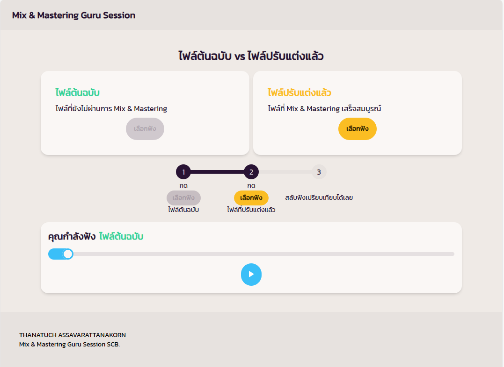

## SOUND AB TESTING

First, run the development server:

```bash
npm run dev
# or
yarn dev
# or
pnpm dev
```

Open [http://localhost:3000](http://localhost:3000) with your browser to see the result.



## ENV

``` 
NEXT_PUBLIC_WEB_TITLE=
NEXT_PUBLIC_YT_HEADER=
NEXT_PUBLIC_YT_TITLE=
NEXT_PUBLIC_FOOTER_1=
NEXT_PUBLIC_FOOTER_2=

NEXT_PUBLIC_FILE_RAW=
NEXT_PUBLIC_FILE_FULL=
NEXT_PUBLIC_FILE_QR=
```


